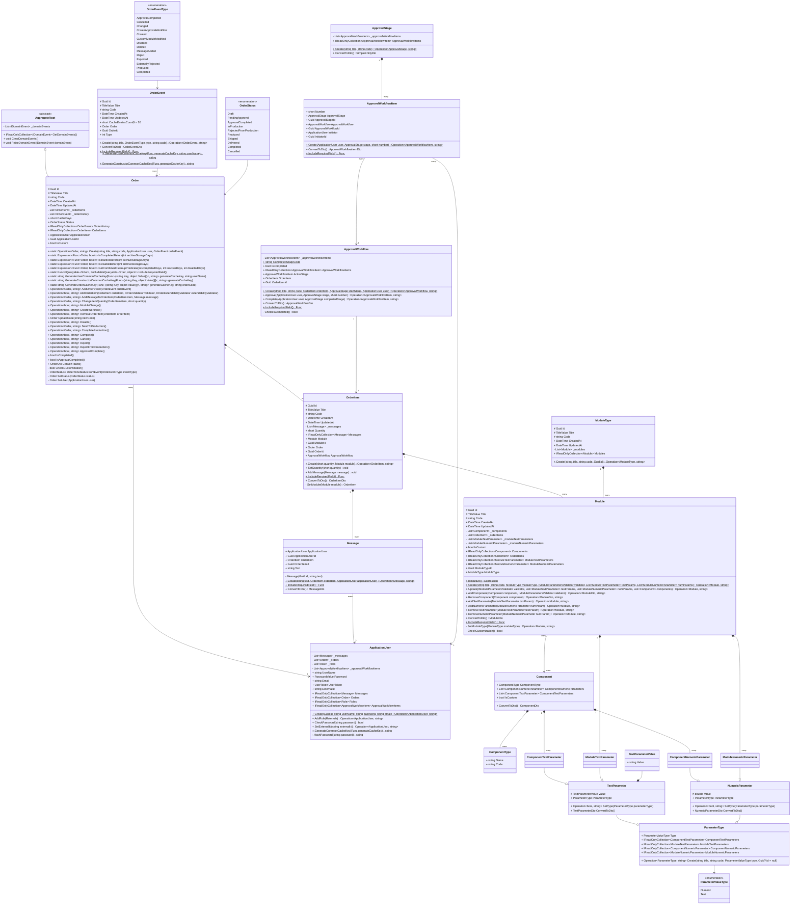

```mermaid

classDiagram

class AggregateRoot:::abstract {
    <<abstract>>
    - List~IDomainEvent~ _domainEvents
    
    + IReadOnlyCollection~IDomainEvent~ GetDomainEvents()
    + void ClearDomainEvents()
    # void RaiseDomainEvent(IDomainEvent domainEvent)
}

class Order {
    # Guid Id
    # TitleValue Title
    # string Code
    + DateTime CreatedAt
    + DateTime UpdatedAt
    - List~OrderItem~ _orderItems
    - List~OrderEvent~ _orderHistory
    + short CacheDays
    + OrderStatus Status
    + IReadOnlyCollection~OrderEvent~ OrderHistory
    + IReadOnlyCollection~OrderItem~ OrderItems
    + ApplicationUser ApplicationUser
    + Guid ApplicationUserId
    
    + static Operation~Order, string~ Create(string title, string code, ApplicationUser user, OrderEvent orderEvent)
    + static Expression~Func~Order, bool~~ IsCompletedBefore(int archiveStorageDays)
    + static Expression~Func~Order, bool~~ IsInactiveBefore(int archiveStorageDays)
    + static Expression~Func~Order, bool~~ IsDisableBefore(int archiveStorageDays)
    + static Expression~Func~Order, bool~~ GetCombinedCleanupPredicate(int completedDays, int inactiveDays, int disabledDays)
    + static Func~IQueryable~Order~, IIncludableQueryable~Order, object~~ IncludeRequiredField()
    + static string GenerateUserCommonCacheKey(Func~(string Key, object Value)[]~, string~ generateCacheKey, string userName)
    + static string GenerateConstructorCommonCacheKey(Func~(string Key, object Value)[]~, string~ generateCacheKey)
    + static string GenerateOrderCacheKey(Func~(string Key, object Value)[]~, string~ generateCacheKey, string orderCode)
    
    + Operation~Order, string~ AddOrderEvent(OrderEvent orderEvent)
    + Operation~bool, string~ AddOrderItem(OrderItem orderItem, IOrderValidator validator, IOrderExtendabilityValidator extendabilityValidator)
    + Operation~Order, string~ AddMessageToOrderItem(OrderItem item, Message message)
    + Operation~Order, string~ ChangeItemQuantity(OrderItem item, short quantity)
    + Operation~bool, string~ ModuleChange()
    + Operation~bool, string~ CreateWorkflow()
    + Operation~bool, string~ RemoveOrderItem(OrderItem orderItem)
    + Order UpdateCode(string newCode)
    + Operation~bool, string~ Disable()
    + Operation~Order, string~ SendToProduction()
    + Operation~Order, string~ CompleteProduction()
    + Operation~bool, string~ Complete()
    + Operation~bool, string~ Cancel()
    + Operation~bool, string~ Reject()
    + Operation~bool, string~ RejectFromProduction()
    + Operation~bool, string~ ApprovalComplete()
    + bool IsCompleted()
    + bool IsApprovalCompleted()
    + bool IsCustom
    + OrderDto ConvertToDto()
    
    - bool CheckCustomization()
    - OrderStatus? DetermineStatusFromEvent(OrderEventType eventType)
    - Order SetStatus(OrderStatus status)
    - Order SetUser(ApplicationUser user)
}

class OrderItem {
    # Guid Id
    # TitleValue Title
    # string Code
    + DateTime CreatedAt
    + DateTime UpdatedAt
    - List~Message~ _messages
    + short Quantity
    + IReadOnlyCollection~Message~ Messages
    + Module Module
    + Guid ModuleId
    + Order Order
    + Guid OrderId
    + ApprovalWorkflow ApprovalWorkflow
    + Create(short quantity, Module module)$ Operation~OrderItem, string~
    + SetQuantity(short quantity) void
    + AddMessage(Message message) void
    + IncludeRequiredField()$ Func
    + ConvertToDto() OrderItemDto
    - SetModule(Module module) OrderItem
}

class Module {
    # Guid Id
    # TitleValue Title
    # string Code
    + DateTime CreatedAt
    + DateTime UpdatedAt
    - List~Component~ _components
    - List~OrderItem~ _orderItems
    - List~ModuleTextParameter~ _moduleTextParameters
    - List~ModuleNumericParameter~ _moduleNumericParameters
    + bool IsCustom
    + IsInactive()$ Expression
    + IReadOnlyCollection~Component~ Components
    + IReadOnlyCollection~OrderItem~ OrderItems
    + IReadOnlyCollection~ModuleTextParameter~ ModuleTextParameters
    + IReadOnlyCollection~ModuleNumericParameter~ ModuleNumericParameters
    + Guid ModuleTypeId
    + ModuleType ModuleType
    + Create(string title, string code, ModuleType moduleType, IModuleParametersValidator validator, List~ModuleTextParameter~ textParams, List~ModuleNumericParameter~ numParams)$ Operation~Module, string~
    + Update(IModuleParametersValidator validator, List~ModuleTextParameter~ textParams, List~ModuleNumericParameter~ numParams, List~Component~ components) Operation~Module, string~
    + AddComponent(Component component, IModuleParametersValidator validator) Operation~ModuleDto, string~
    + RemoveComponent(Component component) Operation~ModuleDto, string~
    + AddTextParameter(ModuleTextParameter textParam) Operation~Module, string~
    + AddNumericParameter(ModuleNumericParameter numParam) Operation~Module, string~
    + RemoveTextParameter(ModuleTextParameter textParam) Operation~Module, string~
    + RemoveNumericParameter(ModuleNumericParameter numParam) Operation~Module, string~
    + ConvertToDto() ModuleDto
    + IncludeRequiredField()$ Func
    - SetModuleType(ModuleType moduleType) Operation~Module, string~
    - CheckCustomization() bool
}

class ModuleType {
    # Guid Id
    # TitleValue Title
    # string Code
    + DateTime CreatedAt
    + DateTime UpdatedAt
    - List~Module~ _modules
    + IReadOnlyCollection~Module~ Modules
    + Create(string title, string code, Guid id)$ Operation~ModuleType, string~
}

class ApplicationUser {
    - List~Message~ _messages
    - List~Order~ _orders
    - List~Role~ _roles
    - List~ApprovalWorkflowItem~ _approvalWorkflowItems
    + string UserName
    + PasswordValue Password
    + string Email
    + UserToken UserToken
    + string ExternalId
    + IReadOnlyCollection~Message~ Messages
    + IReadOnlyCollection~Order~ Orders
    + IReadOnlyCollection~Role~ Roles
    + IReadOnlyCollection~ApprovalWorkflowItem~ ApprovalWorkflowItems
    + Create(Guid id, string userName, string password, string email)$ Operation~ApplicationUser, string~
    + AddRole(Role role) Operation~ApplicationUser, string~
    + CheckPassword(string password) bool
    + SetExternalId(string externalId) Operation~ApplicationUser, string~
    + GenerateCommonCacheKey(Func generateCacheKey)$ string
    - HashPassword(string password)$ string
}

class Message {
    - Message(Guid id, string text)
    + ApplicationUser ApplicationUser
    + Guid ApplicationUserId
    + OrderItem OrderItem
    + Guid OrderItemId
    + string Text
    + Create(string text, OrderItem orderItem, ApplicationUser applicationUser)$ Operation~Message, string~
    + IncludeRequiredField()$ Func
    + ConvertToDto() MessageDto
}

class OrderEvent {
    # Guid Id
    # TitleValue Title
    # string Code
    + DateTime CreatedAt
    + DateTime UpdatedAt
    + short CacheEntriesCount$ = 20
    + Order Order
    + Guid OrderId
    + int Type
    + Create(string title, OrderEventType type, string code)$ Operation~OrderEvent, string~
    + ConvertToDto() OrderEventDto
    + IncludeRequiredField()$ Func
    + GenerateUserCommonCacheKey(Func generateCacheKey, string userName)$ string
    + GenerateConstructorCommonCacheKey(Func generateCacheKey)$ string
}

class OrderEventType {
    <<enumeration>>
    ApprovalCompleted
    Cancelled
    Changed
    CreateApprovalWorkflow
    Created
    CustomModuleModified
    Disabled
    Deleted
    MessageAdded
    Reject
    Exported
    ExternallyRejected
    Produced
    Completed
}

class OrderStatus {
    <<enumeration>>
    Draft
    PendingApproval
    ApprovalCompleted
    InProduction
    RejectedFromProduction
    Produced
    Shipped
    Delivered
    Completed
    Cancelled
}

class ApprovalWorkflow {
    - List~ApprovalWorkflowItem~ _approvalWorkflowItems
    + string CompletedStageCode$
    + bool IsCompleted
    + IReadOnlyCollection~ApprovalWorkflowItem~ ApprovalWorkflowItems
    + ApprovalWorkflowItem ActiveStage
    + OrderItem OrderItem
    + Guid OrderItemId
    + Create(string title, string code, OrderItem orderItem, ApprovalStage startStage, ApplicationUser user)$ Operation~ApprovalWorkflow, string~
    + Approve(ApplicationUser user, ApprovalStage stage, short number) Operation~ApprovalWorkflowItem, string~
    + Complete(ApplicationUser user, ApprovalStage completedStage) Operation~ApprovalWorkflowItem, string~
    + ConvertToDto() ApprovalWorkflowDto
    + IncludeRequiredField()$ Func
    - CheckIsCompleted() bool
}

class ApprovalStage {
    - List~ApprovalWorkflowItem~ _approvalWorkflowItems
    + IReadOnlyCollection~ApprovalWorkflowItem~ ApprovalWorkflowItems
    + Create(string title, string code)$ Operation~ApprovalStage, string~
    + ConvertToDto() SimpleEntityDto
}

class ApprovalWorkflowItem {
    + short Number
    + ApprovalStage ApprovalStage
    + Guid ApprovalStageId
    + ApprovalWorkflow ApprovalWorkflow
    + Guid ApprovalWorkflowId
    + ApplicationUser Initiator
    + Guid InitiatorId
    + Create(ApplicationUser user, ApprovalStage stage, short number)$ Operation~ApprovalWorkflowItem, string~
    + ConvertToDto() ApprovalWorkflowItemDto
    + IncludeRequiredField()$ Func
}

class Component {
    + ComponentType ComponentType
    + List~ComponentNumericParameter~ ComponentNumericParameters
    + List~ComponentTextParameter~ ComponentTextParameters
    + bool IsCustom
    + ConvertToDto() ComponentDto
}

class ComponentType {
    + string Name
    + string Code
}

class ComponentNumericParameter {}

class ComponentTextParameter {}

class ModuleNumericParameter {}

class ModuleTextParameter {}

class ParameterValueType {
    <<enumeration>>
    Numeric
    Text
}

class ParameterType {
    + ParameterValueType Type
    + IReadOnlyCollection~ComponentTextParameter~ ComponentTextParameters
    + IReadOnlyCollection~ModuleTextParameter~ ModuleTextParameters
    + IReadOnlyCollection~ComponentNumericParameter~ ComponentNumericParameters
    + IReadOnlyCollection~ModuleNumericParameter~ ModuleNumericParameters
    
    + Operation~ParameterType, string~ Create(string title, string code, ParameterValueType type, Guid? id = null)
}

class TextParameter {
    # TextParameterValue Value
    + ParameterType ParameterType
    
    + Operation~bool, string~ SetType(ParameterType parameterType)
    + TextParameterDto ConvertToDto()
}

class NumericParameter {
    # double Value
    + ParameterType ParameterType
    
    + Operation~bool, string~ SetType(ParameterType parameterType)
    + NumericParameterDto ConvertToDto()
}

class TextParameterValue {
    + string Value
}

AggregateRoot <|-- Order
Order "many" --> "1" ApplicationUser
Order "1" *-- "many" OrderItem
OrderEvent "many" --> "1" Order
OrderItem "1" *-- "many" Module
Module "many" --> "many" Component
Component "1" *-- "many" ComponentType
Component "1" *-- "many" ComponentNumericParameter
Component "1" *-- "many" ComponentTextParameter
Module "1" *-- "many" ModuleNumericParameter
Module "1" *-- "many" ModuleTextParameter
ModuleType "1" *-- "many" Module
OrderItem "1" *-- "many" Message
OrderEventType --> OrderEvent
OrderStatus --> Order
Message "many" --> "1" ApplicationUser
ApprovalWorkflowItem "many" --> "1" ApprovalWorkflow
ApprovalWorkflow "1" --> "1" OrderItem
ApprovalStage "1" *-- "many" ApprovalWorkflowItem
ApprovalWorkflowItem "many" --> "1" ApplicationUser

ComponentTextParameter --|> TextParameter
ModuleTextParameter --|> TextParameter
ComponentNumericParameter --|> NumericParameter
ModuleNumericParameter --|> NumericParameter

TextParameterValue --* TextParameter  
TextParameter --o ParameterType
NumericParameter --o ParameterType
ParameterType --> ParameterValueType

```