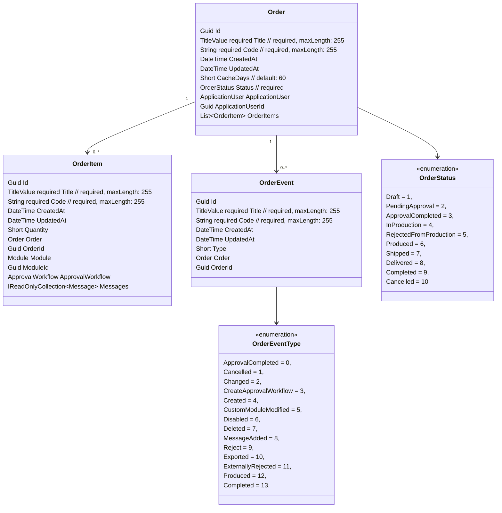

```mermaid
classDiagram

class Order{

    Guid Id
    TitleValue required Title  // required, maxLength: 255
    String required Code // required, maxLength: 255
    DateTime CreatedAt
    DateTime UpdatedAt
    Short CacheDays // default: 60
    OrderStatus Status // required

    ApplicationUser ApplicationUser
    Guid ApplicationUserId
    
    List~OrderItem~ OrderItems
}

class OrderItem{

    Guid Id
    TitleValue required Title  // required, maxLength: 255
    String required Code // required, maxLength: 255
    DateTime CreatedAt
    DateTime UpdatedAt
    
    Short Quantity
    
    Order Order
    Guid OrderId
    
    Module Module
    Guid ModuleId

    ApprovalWorkflow ApprovalWorkflow

    IReadOnlyCollection~Message~ Messages
}

class OrderEvent{
    Guid Id
    TitleValue required Title  // required, maxLength: 255
    String required Code // required, maxLength: 255
    DateTime CreatedAt
    DateTime UpdatedAt

    Short Type

    Order Order
    Guid OrderId
}


class OrderEventType:::abstract {
    <<enumeration>>

    ApprovalCompleted = 0,
    Cancelled = 1,
    Changed = 2,
    CreateApprovalWorkflow = 3,
    Created = 4,
    CustomModuleModified = 5,
    Disabled = 6,
    Deleted = 7,
    MessageAdded = 8,
    Reject = 9,
    Exported = 10,
    ExternallyRejected = 11,
    Produced = 12,
    Completed = 13,
}

class OrderStatus:::abstract {
    <<enumeration>>

    Draft = 1,
    PendingApproval = 2,
    ApprovalCompleted = 3,
    InProduction = 4,
    RejectedFromProduction = 5,
    Produced = 6,
    Shipped = 7,
    Delivered = 8,
    Completed = 9,
    Cancelled = 10
}

Order "1" --> "0..*" OrderItem
Order "1" --> "0..*" OrderEvent
OrderEvent --> OrderEventType
Order --> OrderStatus

```